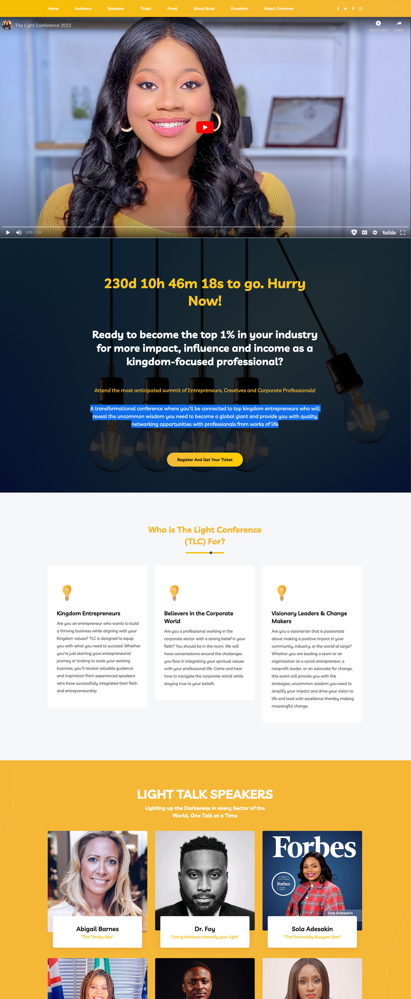
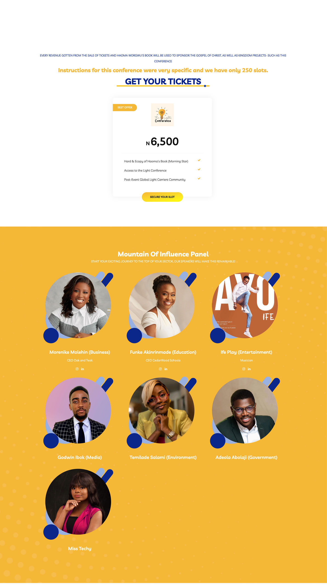
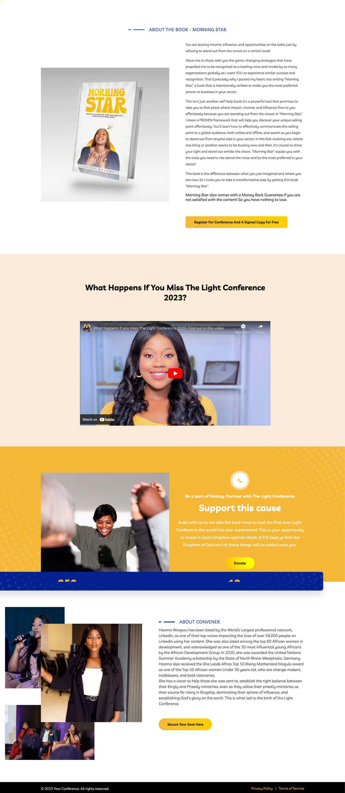

# The Light Conference Website

Welcome to the official repository for The Light Conference website. This website serves as the primary platform for promoting the upcoming conference, which aims to empower kingdom-focused professionals to become the top 1% in their industries for more impact, influence, and income. For more information you can visit their [website.](https://thelightconference.website)

## About the Conference

The Light Conference is the most anticipated summit for Entrepreneurs, Creatives, and Corporate Professionals. It offers a transformational experience where attendees will be connected to top kingdom entrepreneurs who will share uncommon wisdom to help them become global giants. The conference also provides quality networking opportunities with professionals from various walks of life.

## Key Features

- **Event Information**: Detailed information about the conference schedule, speakers, and venue.
- **Registration**: A user-friendly registration form for attendees to secure their spot at the conference.
- **Speaker Profiles**: Profiles of the esteemed speakers who will be sharing their insights and expertise.
- **Contact Link**: A contact link for inquiries or support related to the conference.

## Key Speakers

- **Abigail Barnes** "The Timely Star"
- **Dr. Foy** "Using Media to Intensify Your Light"
- **Sola Adesakin** "The Financially Buoyant Star"
- **Foluke Michael** "The Global Star"
- **Bolu Okunade** "Making Wealth In Your Morning"
- **Funto Ibuoye** "The Kingdom Star On A Mission"

## Technologies Used

- HTML
- CSS
- JavaScript

## Screenshots

## Getting Started

To use this template for your own event or conference, simply clone this repository to your local machine and customize it according to your requirements.

## Contributing

Contributions to this project are welcome! If you have any suggestions for improvements or new features, please feel free to open an issue or submit a pull request.

## License

This project is licensed under the [MIT License](LICENSE).
